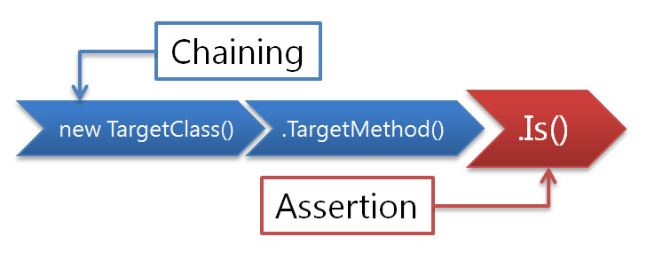
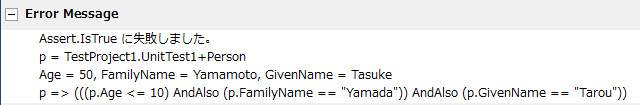

# THIS PROJECT IS ARCHIVED. USE [FluentAssertions](https://fluentassertions.com/) instead.

# Chaining Assertion



Method Chaining base UnitTesting Extension Methods and Dynamic Private Accessor for MSTest, NUnit, xUnit.net, MbUnit. This provides only single file.
NuGet install supported

- [PM> Install-Package ChainingAssertion](https://www.nuget.org/packages/ChainingAssertion) (for MSTest)
- [PM> Install-Package ChainingAssertion-NUnit](http://nuget.org/List/Packages/ChainingAssertion-NUnit) (for NUnit)
- [PM> Install-Package ChainingAssertion-MbUnit](http://nuget.org/List/Packages/ChainingAssertion-MbUnit) (for MbUnit)
- [PM> Install-Package ChainingAssertion-xUnit](http://nuget.org/List/Packages/ChainingAssertion-xUnit) (for xUnit.net)

## Is

easy to write, you can use only one method.

```csharp
// "Is" extend on all object and has three overloads.

// This same as Assert.AreEqual(25, Math.Pow(5, 2))
Math.Pow(5, 2).Is(25);

// lambda predicate assertion.
// This same as Assert.IsTrue("foobar".StartsWith("foo") && "foobar".EndWith("bar"))
"foobar".Is(s => s.StartsWith("foo") && s.EndsWith("bar"));

// collection assert takes variable arguments
// This same as CollectionAssert.AreEqual(Enumerable.Range(1,5), new[]{1, 2, 3, 4, 5})
Enumerable.Range(1, 5).Is(1, 2, 3, 4, 5);
```

## CollectionAssert

if you want to use CollectionAssert Methods then use Linq to Objects and Is.

```csharp
var array = new[] { 1, 3, 7, 8 };

array.Count().Is(4);
array.Contains(8).IsTrue(); // IsTrue() == Is(true)
array.All(i => i < 5).IsFalse(); // IsFalse() == Is(false)
array.Any().Is(true);
new int[] { }.Any().Is(false);   // IsEmpty
array.OrderBy(x => x).Is(array); // IsOrdered
```

## Other Assertions

```csharp
// Null Assertions
Object obj = null;
obj.IsNull();             // Assert.IsNull(obj)
new Object().IsNotNull(); // Assert.IsNotNull(obj)

// Not Assertion
"foobar".IsNot("fooooooo"); // Assert.AreNotEqual
new[] { "a", "z", "x" }.IsNot("a", "x", "z"); /// CollectionAssert.AreNotEqual

// ReferenceEqual Assertion
var tuple = Tuple.Create("foo");
tuple.IsSameReferenceAs(tuple); // Assert.AreSame
tuple.IsNotSameReferenceAs(Tuple.Create("foo")); // Assert.AreNotSame

// Type Assertion
"foobar".IsInstanceOf<string>(); // Assert.IsInstanceOfType
(999).IsNotInstanceOf<double>(); // Assert.IsNotInstanceOfType
```

## Advanced Collection Assertion

```csharp
var lower = new[] { "a", "b", "c" };
var upper = new[] { "A", "B", "C" };

// Comparer CollectionAssert, use IEqualityComparer<T> or Func<T,T,bool> delegate
lower.Is(upper, StringComparer.InvariantCultureIgnoreCase);
lower.Is(upper, (x, y) => x.ToUpper() == y.ToUpper());

// or you can use Linq to Objects - SequenceEqual
lower.SequenceEqual(upper, StringComparer.InvariantCultureIgnoreCase).Is(true);
```

## StructuralEqual

```csharp
class MyClass
{
    public int IntProp { get; set; }
    public string StrField;
}

var mc1 = new MyClass() { IntProp = 10, StrField = "foo" };
var mc2 = new MyClass() { IntProp = 10, StrField = "foo" };

mc1.IsStructuralEqual(mc2); // deep recursive value equality compare

mc1.IntProp = 20;
mc1.IsNotStructuralEqual(mc2);
```

## DynamicAccessor

AsDynamic convert to "dynamic" that can call private method/property/field/indexer.

```csharp
// a class and private field/property/method.
public class PrivateMock
{
    private string privateField = "homu";

    private string PrivateProperty
    {
        get { return privateField + privateField; }
        set { privateField = value; }
    }

    private string PrivateMethod(int count)
    {
        return string.Join("", Enumerable.Repeat(privateField, count));
    }
}

// call private property.
var actual = new PrivateMock().AsDynamic().PrivateProperty;
Assert.AreEqual("homuhomu", actual);

// dynamic can't invoke extension methods.
// if you want to invoke "Is" then cast type.
(new PrivateMock().AsDynamic().PrivateMethod(3) as string).Is("homuhomuhomu");

// set value
var mock = new PrivateMock().AsDynamic();
mock.PrivateProperty = "mogumogu";
(mock.privateField as string).Is("mogumogu");
```

## Is(lambda)'s error message

```csharp
// a model
public class Person
{
    public int Age { get; set; }
    public string FamilyName { get; set; }
    public string GivenName { get; set; }
}

[TestMethod]
public void TestMethod()
{
    // this assertion is fail
    var person = new Person { Age = 50, FamilyName = "Yamamoto", GivenName = "Tasuke" };
    person.Is(p => p.Age <= 10 && p.FamilyName == "Yamada" && p.GivenName == "Tarou");
}
```

error message shows property values



## Exception Test (for MSTest)

```csharp
// Exception Test(alternative of ExpectedExceptionAttribute)
// AssertEx.Throws does not allow derived type
// AssertEx.Catch allows derived type
// AssertEx.ThrowsContractException catch only Code Contract's ContractException
AssertEx.Throws<ArgumentNullException>(() => "foo".StartsWith(null));
AssertEx.Catch<Exception>(() => "foo".StartsWith(null));
AssertEx.ThrowsContractException(() => /* contract method */);

// return value is occured exception
var ex = AssertEx.Throws<InvalidOperationException>(() =>
{
    throw new InvalidOperationException("foobar operation");
});
ex.Message.Is(s => s.Contains("foobar")); // additional exception assertion

// must not throw any exceptions
AssertEx.DoesNotThrow(() =>
{
    // code
});
```

## Parameterized Test (for MSTest)

Parameterized Test like NUnit's TestCase.
TestCase takes parameters and send to TestContext's Extension Method "Run".

```csharp
[TestClass]
public class UnitTest
{
    public TestContext TestContext { get; set; }

    [TestMethod]
    [TestCase(1, 2, 3)]
    [TestCase(10, 20, 30)]
    [TestCase(100, 200, 300)]
    public void TestMethod2()
    {
        TestContext.Run((int x, int y, int z) =>
        {
            (x + y).Is(z);
            (x + y + z).Is(i => i < 1000);
        });
    }
}
```

## TestCaseSource (for MSTest)

TestCaseSource can take static field/property that types is only object[][].

```csharp
[TestMethod]
[TestCaseSource("toaruSource")]
public void TestTestCaseSource()
{
    TestContext.Run((int x, int y, string z) =>
    {
        string.Concat(x, y).Is(z);
    });
}

public static object[] toaruSource = new[]
{
    new object[] {1, 1, "11"},
    new object[] {5, 3, "53"},
    new object[] {9, 4, "94"}
};
```
